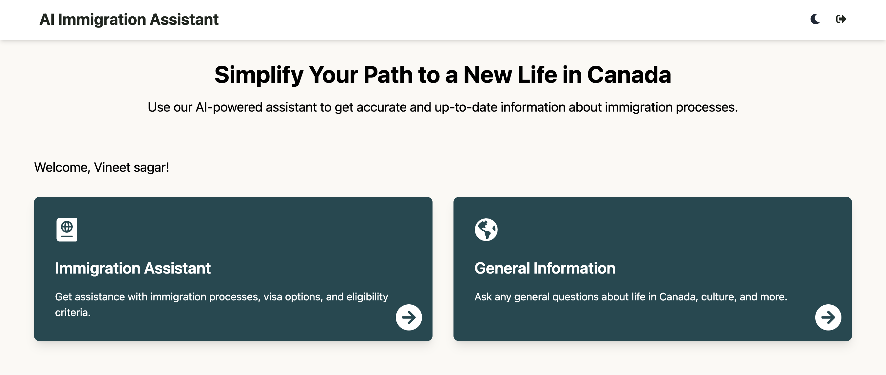

# AI Immigration Assistant

An intelligent chatbot designed to simplify the Canadian immigration process by providing accurate and up-to-date information.



[Live Demo](https://ai-immigration-assistant.vercel.app/)

## Key Features

- Interactive AI-powered chatbot for Canadian immigration queries
- Accurate and up-to-date information on immigration processes
- User authentication for personalized experiences
- Chat history persistence using local storage
- Dark mode and customizable themes
- Responsive design for desktop and mobile devices
- Powered by Google Gemini AI API for intelligent responses
- General information about life in Canada
- Accessibility features

- Multilingual support (Not implemented yet)

**Important Note:** This chatbot is designed for informational purposes only and should not replace professional immigration advice.

## Technologies Used

- Next.js 14
- React
- TypeScript
- Tailwind CSS
- Google Gemini AI API

## Getting Started

1. Clone the repository:
   ```bash
   git clone https://github.com/vineetsgr07/ai-immigration-assistant.git

2. Install dependencies:
   ```bash
   npm install
   ```

3. Create a `.env` file in the root directory and add the following:
   ```bash
   NEXT_PUBLIC_GEMINI_API_KEY=<your-gemini-api-key>
   ```

4. Start the development server:
   ```bash
   npm run dev
   ```

5. Open your browser and navigate to `http://localhost:3000` to access the chat interface.

## Testing

To run the tests, use the following command:
```bash
npm test
```

## Deployment

The application is deployed on Vercel.

## Contributing

We welcome contributions to the project. Please read our [contributing guidelines](CONTRIBUTING.md) for more details.

## License

This project is licensed under the MIT License. See the `LICENSE` file for more details.

## Considerations
 - Google Gemini AI API is used as it's currently free, replacing the previous OpenAI API due to changes in their pricing model.

### About the chatbot:
